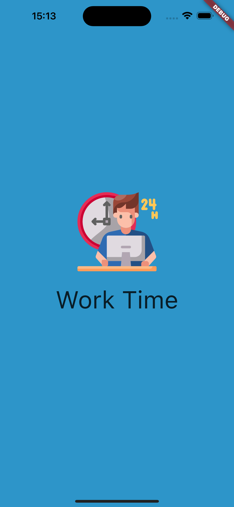

# work-time
<h1 align="center">Work Time: </h1>
<h1 align="center">
</h1>

🚧  Flutter 🚀 Em construção...  🚧

<h1 align="center">
<a href="https://pub.dev/"> Flutter</a></h1>

🚀 

    

 

</h4>
<a href="#Descrição">Descrição</a> •
<a href="#Experiencia">Experiencia</a> •
<a href="#Features">Features</a> •
<a href="#Bibliotecas">Features</a> •
<a href="#Rodar">Rodar</a> • 
<a href="#Observacoes">Rodar</a> •
<a href="#Telas">Telas</a> •  

 
## Descrição

App para gerenciamento de tempo diário de trabalho e intervalos sugeridos para modelo home-office. =>

 
## Experiencia
Com este projeto reforcei conceitos de padrão reativo, e prátiquei o seu uso com "MobX" que um dos mais utilizados gerenciadores de estado para uso no Flutter, aprendi mais sobre co uso do "provider" como gerenciador de arquivos.
Segue abaixo mais detalhes de como tudo isso foi explorado.
### Features
- [x] Indique o seu tempo de trabalho 
- [x] Regule seus intervalos
- [x] Reinicie o processo
- [x] Relaxe no intervalo com uma boa música

### Bibliotecas
- [x] mobx: ^2.1.3
- [x] flutter_mobx: ^2.0.6+5  
- [x] provider: ^6.0.4
- [x] splash_screen_view: ^3.0.0
- [x] animated_splash_screen: ^1.3.0

### Rodar
- [x] Fazer Clone do Projeto
- [x] Baixar dependencias "Flutter pub get"
- [x] Fazer Build "Flutter run"

### Observacoes
- [x] Caso queira ver todos os comandos do build_runner "flutter build_runner --help"
- [x] Caso queira fazer Build para limpar arquivos gerado pelo provider "flutter build_runner clean"
- [x] Caso queira fazer Build para gerar arquivos gerenciados pelo provider "flutter build_runner watch"

### Telas
<h1 align="center">

</h1>